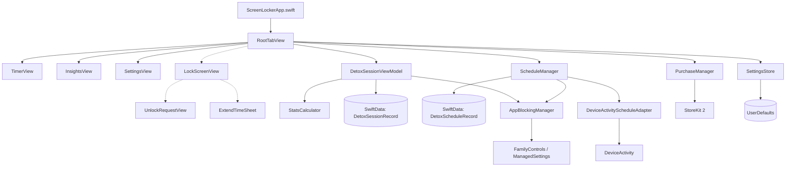

# ScreenLocker

ScreenLocker は、iOS 17+ をターゲットにした、ダークでミニマルな SwiftUI デジタルデトックス・タイマーアプリです。ユーザーが特定の時間スマートフォンから離れ、集中した時間（デトックス時間）を確保できるようサポートします。

---

## 1. 製品コンセプトとコア価値

### コアコンセプト
スマートフォンの使いすぎを防ぐため、デトックスタイマーを起動している間、あらかじめ選択した「気を散らすアプリ」を Apple Screen Time API を利用してシールド（ブロック）します。

### コア価値
ユーザーがスマートフォンを使用しなかった「保護された時間（Protected Time）」を可視化し、「これだけの時間、スマートフォンから離れて過ごすことができた」という自己効力感を提供します。

### デザイン方針
- **ダーク＆ミニマリズム**: SF Symbols を活用した美しくプレミアムなカード UI とスムーズなアニメーション。
- **グラデーションとアクセント**: パープル・ブルー・シアンの美麗なグラデーションとアクセントカラー。
- **直感的な操作**: 精緻な進捗リング（Progress Ring）を中心としたタイマーデザイン。

---

## 2. 機能実装状況 (Status)

現在の実装レベルと Pro 向け機能のロードマップ状況は以下の通りです。

| 機能グループ | 機能詳細 | ステータス | 備考 |
| :--- | :--- | :---: | :--- |
| **Timer / セッション** | ローカルデトックスタイマー起動、進捗表示 | **実装済み** | 進捗リングと残り時間のリアルタイム更新 |
| | タイマー延長（`+5分`, `+15分`, `+30分`、カスタム） | **実装済み** | セッション中に追加時間を適用可能 |
| | ロック解除制限と30秒のカウントダウン待機 | **実装済み** | 衝動的な解除を防ぐための意図的な解除プロセス |
| | 解除理由の選択と「途中終了セッション」の保存 | **実装済み** | 理由カテゴリ選択と SwiftData への保存 |
| **データ永続化** | `DetoxSessionRecord` の保存 (SwiftData) | **実装済み** | 過去セッション、延長、途中解除の全履歴 |
| | 各種ユーザー設定の保存 (UserDefaults) | **実装済み** | デフォルト時間、目標時間、解除遅延、テーマなど |
| **Screen Time** | `FamilyControls` 経由のアプリ選択 UI | **実装済み** | アプリ、カテゴリ、Web ドメインの個別指定 |
| | `ManagedSettings` による選択アプリのシールド | **実装済み** | セッション開始で即時シールド、終了/解除でクリア |
| | 権限未取得・シミュレータ時のローカル代替動作 | **実装済み** | 警告を表示しつつ、タイマー自体は通常稼働 |
| **Pro 機能 (基本)** | `DetoxScheduleRecord` の保存 (SwiftData) | **実装済み** | 定期スケジュール登録、曜日選択、時間範囲設定 |
| | `DeviceActivity` 監視の開始・解除アダプター | **実装済み** | スケジュール有効化に伴う監視登録の抽象化層 |
| | StoreKit 2 課金管理とローカルモック解除 | **実装済み** | 課金情報が無い場合に自動でローカル Pro をデモ有効化 |
| **Pro 機能 (拡張)** | 複数デトックスモードの管理・カスタム | プレースホルダー | `Sleep`, `Deep Focus` 等の定義およびロック表示 |
| | Guided Deep Lock 設定（アンインストール防止等）| プレースホルダー | Screen Time 設定手順を示す学習用ガイド UI |
| | 高度な統計・インサイト (週次/月次/年次) | プレースホルダー | 週次バーチャート表示および曜日別傾向のモック表示 |
| | ウィジェット、Live Activity、テーマ変更など | プレースホルダー | Pro 機能プレースホルダー構造のみ実装 |

---

## 3. システム・アーキテクチャ

SwiftUI + SwiftData を用いたシンプルな MVVM-S 構成を採用しています。



### コア状態遷移と制御フロー
1. **アプリ起動**: `ScreenLockerApp` が環境オブジェクト (`SettingsStore`, `AppBlockingManager`, `PurchaseManager`, `DetoxSessionViewModel`, `ScheduleManager`) をインスタンス化し、SwiftData の `ModelContainer` を構築。
2. **タイマー開始**: `TimerView` で「Start Detox」をタップすると、`DetoxSessionViewModel` が `activeSession` を生成してタイマーを始動。同時に `AppBlockingManager` が起動し、`ManagedSettingsStore` を使って設定されたアプリ群をシールド。
3. **ロック中画面**: セッションがアクティブである間、`RootTabView` が `LockScreenView` をフルスクリーンカバーとして表示し、ユーザーがアプリを離脱しないよう促す。
4. **セッション終了**: 予定時間が完了すると、自動的にシールド設定が解除され、状態が `completed` として SwiftData に永続化。
5. **途中解除**: ユーザーが「Unlock」をタップすると 30 秒の猶予期間が始まり、理由の選択を経てセッションを `broken` 状態で途中終了。シールドがクリアされる。

---

## 4. プロジェクトのディレクトリ構成

```text
ScreenLocker.xcodeproj/     # Xcode プロジェクトファイル
ScreenLocker/
  ├── ScreenLockerApp.swift # アプリのエントリーポイント
  ├── Assets.xcassets/     # アプリのアイコン、アセット素材カタログ
  ├── Models/              # データモデル (SwiftData / enum / struct)
  ├── Services/            # ビジネスロジックと外部 API 連携 (Screen Time, StoreKit 2)
  ├── ViewModels/          # 状態連携・タイマー制御 (DetoxSessionViewModel)
  ├── Views/               # アプリ画面の SwiftUI 実装
  ├── Components/          # 再利用可能な SwiftUI コンポーネント (ボタン、進捗リング等)
  └── Theme/               # カラーパレット、レイアウト定数、修飾子、フォーマッタ
ScreenLockerTests/         # 統計計算やセッション計算のユニットテスト
docs/                      # 実装計画、技術ノート等のドキュメント
```

---

## 5. 主要なデータモデル仕様

### `DetoxSessionRecord` (SwiftData @Model)
デトックスセッションごとの実行結果を記録します。
- `id`: `UUID` (ユニークID)
- `startDate`: `Date` (セッション開始日時)
- `plannedEndDate`: `Date` (セッション終了予定日時)
- `actualEndDate`: `Date?` (セッション実際の終了日時)
- `initialDurationMinutes`: `Int` (開始時に設定したデトックス時間 - 分単位)
- `extendedMinutes`: `Int` (セッション中に追加で延長した時間 - 分単位)
- `status`: `SessionStatus` (状態: `.active`, `.completed`, `.broken`)
- `unlockReason`: `UnlockReason?` (途中解除時の理由)
- `modeId`: `UUID?` (適用されたデトックスモードのID)
- `modeName`: `String` (適用されたデトックスモード名)
- `blockedAppCount`: `Int` (セッション中に制限したアプリの数)

### `DetoxScheduleRecord` (SwiftData @Model)
Pro ユーザー向けの定期予約（スケジュール）設定を記録します。
- `id`: `UUID`
- `title`: `String` (スケジュール名 - 例: "Focus Time")
- `startHour` / `startMinute`: `Int` (開始時刻)
- `endHour` / `endMinute`: `Int` (終了時刻)
- `weekdayRawValues`: `[Int]` (曜日配列: 日曜=1, 土曜=7)
- `durationMinutes`: `Int` (稼働時間)
- `isEnabled`: `Bool` (有効/無効フラグ)
- `modeId`: `UUID?`

### `UnlockReason` (Codable Enum)
セッションを途中で強制解除した際の理由カテゴリです。
- `.urgentReply` - "I need to reply urgently" (至急返信が必要)
- `.specificApp` - "I need a specific app" (特定のアプリを使用したい)
- `.changedMind` - "I changed my mind" (気持ちが変わった)
- `.lockTooLong` - "The lock was too long" (制限時間が長すぎた)
- `.other` - "Other" (その他)

---

## 6. 主要サービス・クラス仕様

### `AppBlockingManager` (Service)
Screen Time APIの `FamilyControls` および `ManagedSettings` を抽象化します。
- **機能**:
  - Screen Time 承認ステータス（`.approved`, `.denied` 等）の要求および更新。
  - セッション開始時に `SettingsStore` から選択したアプリ・カテゴリ・ドメインのトークン群を取得し、`ManagedSettingsStore` にシールド設定を適用。
  - セッション終了または途中解除時に、シールド設定を安全にクリア。
  - **フォールバック**: 権限が取得できない、あるいはシミュレータ環境等の場合は、警告とともにローカルタイマー機能のみを有効化。

### `ScheduleManager` (Service)
SwiftData 上のスケジュール一覧を管理し、`DeviceActivityScheduleAdapter` を呼び出して iOS のシステム監視を制御します。
- **機能**:
  - スケジュールの追加、削除、有効化トグル。
  - 変更時に `DeviceActivityScheduleAdapter` を介してシステム側のスケジューラ更新を実行。

### `DeviceActivityScheduleAdapter` (Service)
iOS の `DeviceActivity` フレームワークを利用して、バックグラウンドでのスケジュール稼働監視を適用または解除します。

### `PurchaseManager` (Service)
StoreKit 2 を利用したアプリ内課金（Pro版アンロック）を管理します。
- **機能**:
  - `Transaction.currentEntitlements` に基づく課金ステータスの更新。
  - **ローカルデモモード**: シミュレータなどで StoreKit 設定ファイルが見つからない、あるいは読み込めない場合は、ユーザーに対して制限を設けずに Pro 機能をローカル体験できるよう、説明とともに自動で Pro ステータスをオンにします。

---

## 7. ビルドとテスト方法

### 推奨環境
- Xcode 15.0以上 (SwiftData, iOS 17 SDK を含むため)
- 推奨ターゲット端末: iPhone 17 シミュレータ / iOS 17 以上の実機

### テストの実行
ユニットテスト (`ScreenLockerTests`) には、統計情報の集計ロジック (`StatsCalculatorTests`) やセッションの計算ロジック (`DetoxSessionRecordTests`) の検証コードが含まれており、署名なしでシミュレータ上で実行可能です。

```sh
xcodebuild \
  -project ScreenLocker.xcodeproj \
  -scheme ScreenLocker \
  -configuration Debug \
  -destination 'platform=iOS Simulator,name=iPhone 17' \
  CODE_SIGNING_ALLOWED=NO \
  test
```

### ビルドのみ実行
```sh
xcodebuild \
  -project ScreenLocker.xcodeproj \
  -scheme ScreenLocker \
  -configuration Debug \
  -destination 'platform=iOS Simulator,name=iPhone 17' \
  CODE_SIGNING_ALLOWED=NO \
  build
```

---

## 8. 安全上のガイドラインと仕様上の制約

Apple の Screen Time API を利用するにあたって、App Store 審査および実用上の理由から、製品内の説明テキストおよびコードの振る舞いには厳格な設計ルールを設けています。

1. **非絶対的な表現ルール**:
   - アプリ単体で「iOS 自体のアンインストールを完全に阻止する」「端末の電源操作や設定アプリへのアクセスを完全に無効化する」といった絶対的な表現は絶対に行いません。
   - 推奨表現:
     - "Guide to set up via Screen Time" (Screen Time を介したセットアップガイド)
     - "Reduce common escape routes" (一般的な抜け道を減らす)
     - "Add an extra layer of protection" (保護レイヤーを追加する)
2. **証明書・認証情報の取り扱い**:
   - リポジトリに開発用のプロビジョニングプロファイル、App Store Connect 秘密鍵、あるいは署名証明書などを直接含めることは避けてください。
   - `CODE_SIGNING_ALLOWED=NO` を指定したビルド設定を維持し、署名エラーなしにシミュレータでの動作テストが行えるようにしています。
